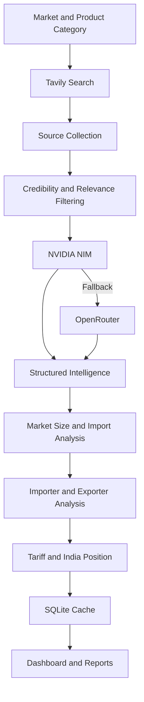
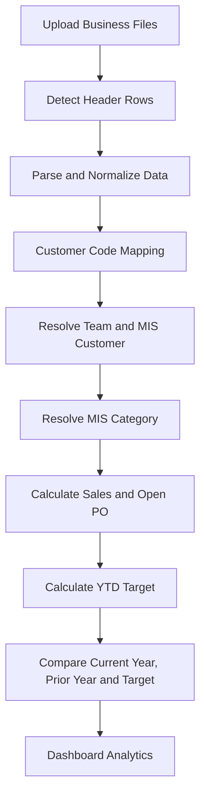

<p align="center">
  
</p>

<div align="center">

# Sales Intelligence Dashboard

### AI-Powered Sales vs Target Management and Market Intelligence Platform


<br>


</div>

---

# Overview

Sales Intelligence Dashboard is a self-hosted enterprise management platform for monthly Sales vs Target reviews, open Purchase Order tracking, team-wise performance analysis, customer intelligence, market information, meeting governance, and AI-assisted business decision support.

The platform follows a Business Year from October to September and combines Sales, Target, Customer, Product Category, Quarter, and Open PO data into a unified dashboard.

It also includes AI-powered market intelligence using Tavily search, NVIDIA NIM, and OpenRouter fallback models.

---

# Core Features

- Sales vs Target Dashboard
- Open PO Visibility
- Current Year vs Prior Year Comparison
- Business Year from October to September
- Quarter-wise Target Tracking
- YTD Target Calculation
- Team-wise Performance Analysis
- Customer-wise Performance Analysis
- MIS Category Analysis
- Region and Country Analysis
- Program Margin Analysis
- Monthly Meeting Minutes
- Action Point Tracking
- Team Notes
- User and Role Management
- Per-user Tab Access
- AI Market News
- AI Market Information
- Scheduled Intelligence Jobs
- One-time Market Refresh Jobs
- Excel and CSV Upload
- SQLite Persistence
- Docker Deployment
- REST API Backend

---

# AI Agent Capabilities

- Market-size analysis
- Import and domestic production analysis
- Major importer identification
- Domestic manufacturer analysis
- Exporting-country comparison
- India market position
- Customs duty and tariff analysis
- Product subcategory breakdown
- Monthly market news filtering
- Source credibility scoring
- Relevance scoring
- Business impact summaries
- Structured JSON generation
- NVIDIA-to-OpenRouter fallback
- Cached intelligence during provider failures

---

# System Architecture

```text
                        Business Users
                              │
                              ▼
                  Web Dashboard / Frontend
                              │
                              ▼
                         Flask API
                              │
         ┌────────────────────┼────────────────────┐
         │                    │                    │
         ▼                    ▼                    ▼
 Sales Analytics       Market Intelligence   Admin & Governance
         │                    │                    │
         ▼                    ▼                    ▼
 Pandas Processing     Tavily Web Search     Authentication / RBAC
         │                    │                    │
         ▼                    ▼                    ▼
 Target / Sales / PO   NVIDIA NIM / OpenRouter   SQLite
         │                    │                    │
         └────────────────────┼────────────────────┘
                              ▼
                    Management Intelligence
```

---

# AI Intelligence Workflow



---

# Sales Processing Workflow



---

# Required Business Files

| File | Main Purpose |
|---|---|
| Customer and Team Master | Resolves customer name, team, MIS customer, and region |
| MIS Category Master | Maps product hierarchy to a consolidated MIS category |
| Quarter Master | Maps calendar months to business-year quarters |
| Target | Stores quarterly targets by customer and product hierarchy |
| Sales | Stores SAP invoice sales transactions |
| Open PO | Stores pending purchase orders and expected shipment data |

### Supported File Formats

- XLSX
- XLS
- XLSB
- CSV

Header rows below report banners are detected automatically.

---

# Business Rules

```text
Business Year = October to September

Q1 = October to December
Q2 = January to March
Q3 = April to June
Q4 = July to September

Sales Amount USD Mn. = Sell.Value / 1,000,000

Open PO Amount USD Mn. = Invoice Amount / 1,000,000

Team = Customer Master lookup using Customer Code

MIS Customer = Customer Master lookup using Customer Code

MIS Category Resolution Priority:

Product Third Category
        ↓
Product Sub Category
        ↓
Product Category
        ↓
First Matching MIS Category
```

YTD target includes completed quarters in full and a one-third allocation for each completed month in the current quarter.

---

# Dashboard Modules

## Data Management

Upload and manage master files, target files, sales files, and open PO files.

## Overall Business

Review consolidated sales, target, open PO, achievement, growth, and prior-year performance.

## Team-wise Analysis

Analyse sales performance by team with role-based data restrictions.

## Market Analysis

Review region, country, customer, and MIS category performance.

## Market News

View AI-filtered market updates from credible government, trade, news, and industry sources.

## Market Information

Generate detailed country and product-category intelligence using Tavily, NVIDIA NIM, and OpenRouter.

## Program Margin

Analyse program-level commercial data and margin performance.

## Meeting Minutes

Record monthly sales-review meetings and management action points.

## Team Notes

Maintain team-level meeting notes, negotiations, challenges, and business-lost records.

## Administration

Manage users, roles, teams, tab access, categories, products, and market mappings.

---

# Market Intelligence Output

The AI Market Information module generates structured analysis for:

- Total market size
- Domestic production value
- Import value
- Import penetration
- Year-over-year growth
- Major importing companies
- Major domestic manufacturers
- Major exporting countries
- India's export rank
- India's market share
- India's category breakdown
- Customs duties
- Anti-dumping duties
- Countervailing duties
- VAT or GST
- FTA rates
- Confidence level
- Data sources

---

# Market News Intelligence

The Market News AI workflow:

1. Builds search queries for each market and product category.
2. Searches the web using Tavily.
3. Removes duplicate results.
4. Filters results by relevance and credibility.
5. Summarizes selected updates using NVIDIA NIM.
6. Falls back to OpenRouter when NVIDIA is unavailable.
7. Generates business-impact commentary.
8. Saves approved updates to SQLite.
9. Displays the results by team, market, category, and period.

---

# User Roles

| Role | Access |
|---|---|
| Admin | Full access to uploads, configuration, users, intelligence, and all teams |
| Business Analyst | Dashboard analysis and meeting-minute editing |
| Team User | Restricted to assigned team or teams |

Per-user access can be configured for:

- Program Margin
- Market News
- Market Information

---

# REST API

## Authentication

```http
POST /api/auth/login
GET  /api/auth/me
```

## Dashboard

```http
POST /api/dashboard
GET  /api/status
```

## Access Control

```http
GET  /api/tab-access
POST /api/admin/tab-access
```

## Market Information

```http
GET  /api/mi/regions
GET  /api/mi/categories
GET  /api/mi/team-markets
GET  /api/market-info/schedule
POST /api/market-info/refresh-all
GET  /api/market-info/refresh-all/status
```

## Market Intelligence

```http
GET  /api/market-intelligence
POST /api/market-intelligence/run
GET  /api/market-intelligence/status
```

## Data Management

```http
POST /api/upload
GET  /api/datasets
DELETE /api/datasets/{dataset_key}
```

## Meeting Minutes

```http
GET  /api/meeting-minutes
POST /api/meeting-minutes
PUT  /api/meeting-minutes/{minute_id}
DELETE /api/meeting-minutes/{minute_id}
```

## Team Notes

```http
GET  /api/team-notes
POST /api/team-notes
PUT  /api/team-notes/{note_id}
DELETE /api/team-notes/{note_id}
```

> Endpoint availability may depend on the final route names in your `app.py` file.

---

# Technology Stack

| Layer | Technology |
|---|---|
| Backend | Flask |
| Frontend | HTML, CSS, Vanilla JavaScript |
| Database | SQLite |
| Data Processing | Pandas and NumPy |
| Excel Support | OpenPyXL, pyxlsb, and xlrd |
| Authentication | Token Authentication and Werkzeug Password Hashing |
| Scheduling | APScheduler |
| Search Engine | Tavily |
| Primary AI | NVIDIA NIM |
| Fallback AI | OpenRouter |
| Production Server | Gunicorn |
| Containerization | Docker and Docker Compose |

---

# Project Structure

```text
sales-dashboard/
│
├── app.py
├── intelligence.py
├── market_info.py
├── env_utils.py
├── requirements.txt
├── README.md
├── CLAUDE.md
├── Dockerfile
├── docker-compose.yml
├── .dockerignore
├── .gitignore
├── .env.example
│
├── frontend/
│   └── index.html
│
└── data/
    └── dashboard.db
```

---

# Environment Variables

Create a `.env` file in the project root.

```env
ADMIN_PASSWORD=change_this_password

DATA_DIR=./data

TAVILY_API_KEY=your_tavily_api_key

NVIDIA_API_KEY=your_nvidia_api_key

OPENROUTER_API_KEY=your_openrouter_api_key

NVIDIA_MODEL=nvidia/nemotron-3-ultra-550b-a55b

MI_MODEL=openai/gpt-oss-20b:free
```

Do not commit real API keys or the `.env` file to GitHub.

---

# Installation

## Clone the Repository

```bash
git clone https://github.com/yourusername/sales-intelligence-dashboard.git
```

```bash
cd sales-intelligence-dashboard
```

## Create a Virtual Environment

```bash
python -m venv .venv
```

### Activate on Windows

```bash
.venv\Scripts\activate
```

### Activate on Linux or macOS

```bash
source .venv/bin/activate
```

## Install Dependencies

```bash
pip install -r requirements.txt
```

## Run the Application

```bash
python app.py
```

Open the dashboard:

```text
http://127.0.0.1:8000
```

---

# Docker Deployment

## Build and Run

```bash
docker compose up --build
```

## Run in Detached Mode

```bash
docker compose up -d --build
```

## Stop the Application

```bash
docker compose down
```

Open:

```text
http://localhost:8000
```

---

# Scheduler

The platform supports background scheduling for:

- Monthly market intelligence generation
- Daily stale-cache refresh
- One-time user-configured market refresh jobs
- Restoration of pending one-time jobs after application restart

---

# Database

Main SQLite tables include:

- `datasets`
- `users`
- `tokens`
- `tab_access`
- `team_note_items`
- `meeting_minutes`
- `meeting_action_items`
- `team_meeting_notes`
- `mi_categories`
- `mi_products`
- `mi_team_markets`
- `mi_updates`
- `mi_job_logs`
- `market_info_cache`
- `market_info_refresh_log`
- `mi_oneshot_jobs`

---

# Security

- Password hashing
- Token-based authentication
- Role-based access control
- Team-level data isolation
- Per-user tab permissions
- Server-side API credentials
- Environment-based configuration
- API request validation
- Protected admin operations
- Local database persistence

---

# Performance and Reliability

- Cached market intelligence
- NVIDIA NIM to OpenRouter fallback
- Scheduled refresh jobs
- Automatic header-row detection
- Cached data usage after API failures
- Persistent one-time scheduled jobs
- Structured JSON validation
- API timeout and retry controls
- SQLite-based local persistence

---

# Default Login

```text
Username: admin
Password: admin123
```

Change the default password through the `ADMIN_PASSWORD` environment variable before production deployment.

---

# Future Enhancements

- Predictive sales forecasting
- Natural-language dashboard assistant
- Automated management commentary
- SAP live integration
- Power BI connector
- Automated email reports
- Advanced anomaly detection
- Customer churn prediction
- Opportunity scoring
- Mobile dashboard
- Enterprise SSO
- PostgreSQL deployment
- Kubernetes support
- Cloud object storage
- Audit report export

---

# Developer

## SNEHAL LAXMAN JADHAV

### AI Engineer

### Navneet Education Limited

---

# License

This project is intended for internal enterprise use unless another license is specified by the repository owner.

---

<div align="center">

# Smarter Sales. Stronger Decisions.

### AI-Powered Management Intelligence for Modern Business Teams

**Python • Flask • SQLite • Pandas • Tavily • NVIDIA NIM • OpenRouter • Docker**

<br>


</div>

<p align="center">
  
</p>
